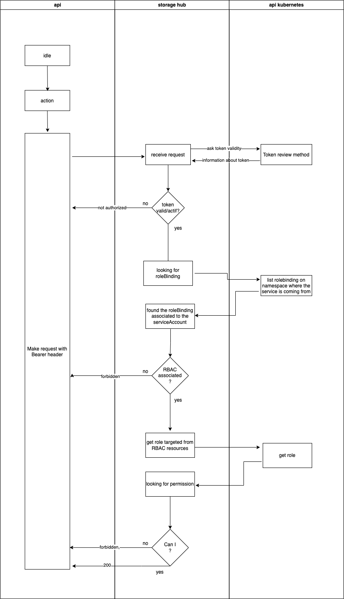

# Service 2 Service auth using kubernetes rbac 

## PROS

* System de RBAC déjà créé
* Gestion des JWT avec la revocation (possibilité de rotation des token de service account)
* Rapidité => pas d'API externe, que de l'api kubernetes
* Possibilité de créer un serviceAccount avec un role associé utilisable depuis l'exterieur

## CONS

* ca reste un hack => c'est le debut d'un controllerk8s sans vraiment l'implémenter
* petite connaissance du kube demandé?
